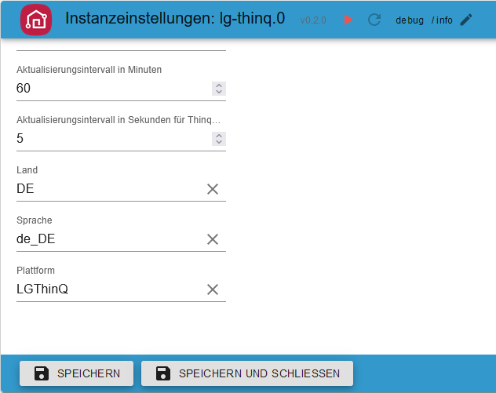
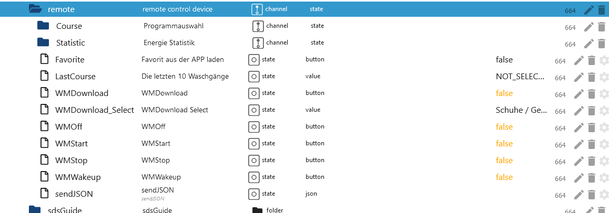
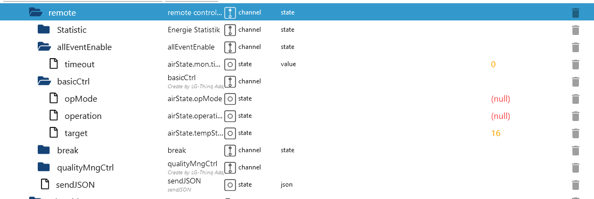

# IoBroker.lg-thinq
[返回自述文件](/README.md)

＃ 介绍
适配器使用数据点`modelJsonUri`（设备偏差）中的模板创建所有数据点，并使用数据点`langPackModelUri`（设备偏差）中的模板进行转换。因此，在 REMOTE 下创建的数据点可能没有功能或不适用于设备。

＃ 概括
- [实例设置](#instance-settings)
- [设置 LG-Thinq](#instance-setting-lg-thinq)
- [Thinq1 间隔](#interval-thinq1-lg-thinq)
- [数据点](#数据点)
- [Datapoint Device 101 冰箱/冷冻柜](#device-101-refrigeratorfreezer-thinq1--thinq2)
- [远程统计](#101-remote-statistic-thinq2)
- [远程基本命令](#101-remote-control-thinq1--thinq2)
- [快照](#101-快照-thinq1--thinq2)
- [Datapoint 设备 201 签名](#device-201-washer-signature-thinq2)
- [远程基本命令](#201-remote-control-signature-thinq2)
- [Datapoint Device 201 洗衣机](#device-201-washer-thinq1--thinq2)
- [远程统计](#201-remote-statistic-thinq2)
- [远程基本命令](#201-remote-control-thinq1--thinq2)
- [快照](#201-快照-thinq1--thinq2)
- [Datapoint Device 202 烘干机](#device-202-dryer-thinq1--thinq2)
- [远程统计](#202-remote-statistic-thinq2)
- [远程基本命令](#202-remote-control-thinq1--thinq2)
- [快照](#202-快照-thinq1--thinq2)
- [Datapoint Device 401 空调 Thinq2](#device-401-air-conditioner-thinq2)
- [远程统计](#401-remote-statistic-thinq2)
- [远程基本命令](#401-remote-control-thinq2)
- [远程假期](#401-remote-holiday-thinq2)
- [快照](#401-快照-thinq2)
- [Datapoint Device 401 空调 Thinq1](#device-401-air-conditioner-thinq1)
- [远程统计](#401-remote-statistic-thinq1)
- [远程基本命令](#401-remote-control-thinq1)
- [快照](#401-快照-thinq1)
- [Datapoint Device 406 头部泵](#device-406-heat-pump-thinq2)
- [远程统计](#406-remote-statistic-thinq2)
- [远程基本命令](#406-remote-basicctrl-thinq2)
- [远程计划设置](#406-remote-reservationctrl-thinq2)
- [快照](#406-snapshot-thinq2)
- [天气](#天气)

# 实例设置
### 实例设置 LG-Thinq
[概括](#summary)

- `LG ThinQ Email`: 输入 APP 电子邮件
- `LG ThinQ 密码`：输入 APP 密码
- `更新间隔（分钟）`：建议：60 分钟。如果间隔 thinq1 设置为 0，则这里为 0.5/1 分钟
- `Thinq1 的更新间隔（秒）（每台设备 1 秒）`：Thinq1 用户的间隔
- `国家`：输入国家 - 默认为 DE
- `语言`：输入语言 - 默认 de_DE
- `平台`: 输入平台 - 默认 LGThinQ



### 间隔 Thinq1 LG-Thinq
[概括](#summary)

- `interval.active` 当前有多少设备正在接收更新
- `interval.inactive` 当前有多少设备未接收更新
- `interval.interval` 从实例设置更改间隔。适配器重启后，将应用实例设置。
- `interval.last_update` 最新更新
-`间隔.状态设备`
- `OK` 间隔确定
- `失败 - 0100` 请求失败 - 重新创建 WorkID
- `失败-0106` 未连接设备 - WorkID 已重新创建
- `Error` 错误 WorkID - WorkID 已重新创建
    - `错误<code>` Unknown error - WorkID is recreated</code>
- `结果错误`接收错误 - WorkID 被重新创建
- `解析错误` 解析错误 - WorkID 已重新创建
- `Unknown` 未知错误 - WorkID 已重新创建
- `Request` 接收未知 - WorkID 已重新创建
- `{}` 未知 - WorkID 已重新创建

    

# 数据点
### 设备 101 冰箱/冰柜 Thinq1 和 Thinq2
[概括](#summary)

### 101 所有文件夹 thinq1 & thinq2


### 101 远程文件夹 thinq1 和 thinq2


### 101 远程统计 thingq2
[概括](#summary)

- `remote.Statistic.command` 应该加载哪些历史记录
- 每小时
- `remote.Statistic.endDate` 输入每小时的日期，结束和开始必须相同 格式：2023.12.01
- `remote.Statistic.startDate` 输入每小时的日期，结束和开始必须相同 格式：2023.12.01
- 或每日
- `remote.Statistic.endDate` 每日输入日期 - 格式：2023.12.06
- `remote.Statistic.startDate` 每日输入日期 - 格式：2023.12.01
- 或每月
- `remote.Statistic.endDate` 输入每月日期 - 格式：2023.12.01
- `remote.Statistic.startDate` 输入每月日期 - 格式：2023.10.01
- `remote.Statistic.period` 选择时间段
- `remote.Statistic.sendRequest` 发送选择
- `remote.Statistic.jsonResult` 统计数据为 JSON。如果属性为空，则表示您的设备不支持它们或指定了错误的日期。

  

示例 JSON 门打开

```json
{
  "item": [
    {
      "usedDate": "2023-11",
      "doorType": "DID_DOOR",
      "openCount": "0",
      "openTime": "0"
    },
    {
      "usedDate": "2023-12",
      "doorType": "DID_DOOR",
      "openCount": "0",
      "openTime": "0"
    },
    {
      "usedDate": "2023-11",
      "doorType": "FREEZER_DOOR",
      "openCount": "62",
      "openTime": "713937"
    },
    {
      "usedDate": "2023-12",
      "doorType": "FREEZER_DOOR",
      "openCount": "0",
      "openTime": "0"
    },
    {
      "usedDate": "2023-11",
      "doorType": "FRIDGE_DOOR",
      "openCount": "1037",
      "openTime": "12421700"
    },
    {
      "usedDate": "2023-12",
      "doorType": "FRIDGE_DOOR",
      "openCount": "27",
      "openTime": "304857"
    },
    {
      "usedDate": "2023-11",
      "doorType": "CONVERTIBLE_DOOR",
      "openCount": "0",
      "openTime": "0"
    },
    {
      "usedDate": "2023-12",
      "doorType": "CONVERTIBLE_DOOR",
      "openCount": "0",
      "openTime": "0"
    },
    {
      "usedDate": "2023-11",
      "doorType": "ONE_DOOR",
      "openCount": "0",
      "openTime": "0"
    },
    {
      "usedDate": "2023-12",
      "doorType": "ONE_DOOR",
      "openCount": "0",
      "openTime": "0"
    }
  ]
}
```

### 101 远程控制 Thinq1 和 Thinq2
[概括](#summary)

- `remote.expressMode` 快速模式开/关/快速开启 -> thinq1 数据点快照.IcePlus
- `remote.freezerTemp` 改变冰箱的温度（仅限摄氏度）
- `remote.fridgeTemp` 改变冰箱的温度（仅限摄氏度）

    

### 101 快照 Thinq1 和 Thinq2
[概括](#summary)


### 设备 201 洗衣机签名 Thinq2
[概括](#summary)

### 201 远程控制签名 Thinq2
- 可以像201一样进行控制。但是，必须在`Course`文件夹中设置以下值。
- 在课程文件夹中：initialBit on INITIAL_BIT_ON
- 在课程文件夹中：remoteStart on REMOTE_START_ON

### 设备 201 洗衣机 Thinq1 和 Thinq2
[概括](#summary)

### 201 所有文件夹 thinq1 和 thinq2


### 201 远程文件夹 thinq1 和 thinq2


### 201 远程统计 thingq2
[概括](#summary)

- 每小时
- `remote.Statistic.endDate` 输入每小时的日期，结束和开始必须相同 格式：2023.12.01
- `remote.Statistic.startDate` 输入每小时的日期，结束和开始必须相同 格式：2023.12.01
- 或每日
- `remote.Statistic.endDate` 每日输入日期 - 格式：2023.12.06
- `remote.Statistic.startDate` 每日输入日期 - 格式：2023.12.01
- 或每月
- `remote.Statistic.endDate` 输入每月日期 - 格式：2023.12.01
- `remote.Statistic.startDate` 输入每月日期 - 格式：2023.10.01
- `remote.Statistic.period` 选择时间段
- `remote.Statistic.sendRequest` 发送选择
- `remote.Statistic.jsonResult` 统计数据为 JSON。如果属性为空，则表示您的设备不支持它们或指定了错误的日期。

    

```json
{
  "count": 0,
  "power": 0,
  "energyWater": 0,
  "energyDetergent": 0,
  "energySoftener": 0,
  "powerWh": 0,
  "periodicEnergyData": 0,
  "item": [
    {
      "usedDate": "2023-12-04",
      "count": 0,
      "power": 0,
      "energyWater": 0,
      "energyDetergent": 0,
      "energySoftener": 0,
      "powerWh": 0,
      "periodicEnergyData": 0
    },
    {
      "usedDate": "2023-12-05",
      "count": 0,
      "power": 0,
      "energyWater": 0,
      "energyDetergent": 0,
      "energySoftener": 0,
      "powerWh": 0,
      "periodicEnergyData": 0
    },
    {
      "usedDate": "2023-12-06",
      "count": 2,
      "power": 2,
      "energyWater": 0,
      "energyDetergent": 0,
      "energySoftener": 0,
      "powerWh": 0,
      "periodicEnergyData": 2
    },
    {
      "usedDate": "2023-12-07",
      "count": 2,
      "power": 2,
      "energyWater": 0,
      "energyDetergent": 0,
      "energySoftener": 0,
      "powerWh": 0,
      "periodicEnergyData": 2
    },
    {
      "usedDate": "2023-12-08",
      "count": 5,
      "power": 5,
      "energyWater": 0,
      "energyDetergent": 0,
      "energySoftener": 0,
      "powerWh": 0,
      "periodicEnergyData": 5
    },
    {
      "usedDate": "2023-12-09",
      "count": 0,
      "power": 0,
      "energyWater": 0,
      "energyDetergent": 0,
      "energySoftener": 0,
      "powerWh": 0,
      "periodicEnergyData": 0
    },
    {
      "usedDate": "2023-12-10",
      "count": 0,
      "power": 0,
      "energyWater": 0,
      "energyDetergent": 0,
      "energySoftener": 0,
      "powerWh": 0,
      "periodicEnergyData": 0
    }
  ]
}
```

### 201 远程控制 Thinq1 和 Thinq2
[概括](#summary)

- `remote.Favorite` 仅当在APP中选择了收藏，并且机器处于开机状态时才有效。
- `remote.LastCourse` 可以选择最后 10 个程序。
- `remote.WMDownload_Select` 选择所有可用程序（STD=标准/DL=下载程序）

当 3 个数据点之一被填满时，所选程序将写入 Course 文件夹。然后您可以在此处进行调整。但是，并非 `Course` 文件夹中的所有数据点都可以更改。请自行测试洗衣机接受哪些数据。

- 按下`remote.WMDownload`，‘Course’文件夹中的程序将传输到洗衣机并显示在显示屏上（洗衣机必须打开）。
- `remote.WMStart` 启动洗衣机
- `remote.WMStop` 停止垫圈
- `remote.WMWakeup` 唤醒洗衣机


### 201 快照 Thinq1 和 Thinq2
[概括](#summary)

  

### 设备 202 烘干机 Thinq1 和 Thinq2
[概括](#summary)

### 202 所有文件夹 thinq1 & thinq2


### 202 远程文件夹 thinq1 & thinq2


### 202 远程统计 thinq2
[概括](#summary)

- 每小时
- `remote.Statistic.endDate` 输入每小时的日期，结束和开始必须相同 格式：2023.12.01
- `remote.Statistic.startDate` 输入每小时的日期，结束和开始必须相同 格式：2023.12.01
- 或每日
- `remote.Statistic.endDate` 每日输入日期 - 格式：2023.12.06
- `remote.Statistic.startDate` 每日输入日期 - 格式：2023.12.01
- 或每月
- `remote.Statistic.endDate` 输入每月日期 - 格式：2023.12.01
- `remote.Statistic.startDate` 输入每月日期 - 格式：2023.10.01
- `remote.Statistic.period` 选择时间段
- `remote.Statistic.sendRequest` 发送选择
- `remote.Statistic.jsonResult` 统计数据为 JSON。如果属性为空，则表示您的设备不支持它们或指定了错误的日期。

    

```json
{
  "count": 0,
  "power": 0,
  "energyWater": 0,
  "energyDetergent": 0,
  "energySoftener": 0,
  "powerWh": 0,
  "periodicEnergyData": 0,
  "item": [
    {
      "usedDate": "2023-12-08",
      "count": 5,
      "power": 2587, // 2587 / 1000 kwh
      "energyWater": 0,
      "energyDetergent": 0,
      "energySoftener": 0,
      "powerWh": 0,
      "periodicEnergyData": 2587
    }
  ]
}
```

### 202 远程控制 Thinq1 和 Thinq2
[概括](#summary)

- `remote.Favorite` 仅当在APP中选择了收藏，并且机器处于开机状态时才有效。
- `remote.LastCourse` 可以选择最后 10 个程序。
- `remote.WMDownload_Select` 选择所有可用程序（STD=标准/DL=下载程序）

当 3 个数据点之一填满后，所选程序将写入 Course 文件夹。然后您可以在此处进行调整。但是，并非 `Course` 文件夹中的所有数据点都可以更改。请自行测试烘干机接受哪些数据。

- `remote.WMDownload` 无功能
- 按下`remote.WMStart`，‘Course’文件夹中的程序将传输到烘干机并显示在显示屏上（烘干机必须打开）。
- `remote.WMStop` 停止烘干机
- `remote.WMWakeup` 唤醒烘干机



### 202 快照 Thinq1 和 Thinq2
[概括](#summary)

  

### 设备 401 空调 Thinq2
[概括](#summary)

### 401 所有文件夹 Thinq2


### 401 远程文件夹 Thinq2


### 401 远程统计 thinq2
[概括](#summary)

- `remote.Statistic.command` 应该加载哪些历史记录
- 每小时
- `remote.Statistic.endDate` 输入每小时的日期，结束和开始必须相同 格式：2023.12.01
- `remote.Statistic.startDate` 输入每小时的日期，结束和开始必须相同 格式：2023.12.01
- 或每日
- `remote.Statistic.endDate` 每日输入日期 - 格式：2023.12.06
- `remote.Statistic.startDate` 每日输入日期 - 格式：2023.12.01
- 或每月
- `remote.Statistic.endDate` 输入每月日期 - 格式：2023.12.01
- `remote.Statistic.startDate` 输入每月日期 - 格式：2023.10.01
- `remote.Statistic.period` 选择时间段
- `remote.Statistic.sendRequest` 发送选择
- `remote.Statistic.jsonResult` 统计数据为 JSON。如果属性为空，则表示您的设备不支持它们或指定了错误的日期。

    

```json
[
  {
    "usedDate": "2023-04",
    "energyData": "0",
    "operationTime": "0"
  },
  {
    "usedDate": "2023-05",
    "energyData": "0",
    "operationTime": "0"
  },
  {
    "usedDate": "2023-06",
    "energyData": "3800",
    "operationTime": "13873"
  }
]
```

### 401 远程控制 thingq2
[概括](#summary)

- `remote.basicCtrl.operation` 0 表示关闭
- `remote.basicCtrl.operation` 1 表示开启
- `remote.basicCtrl.target` 所需温度

- 如果日志中出现错误消息 400，则表示该数据点与设备不兼容。



### 401 远程假期 thingq2
[概括](#summary)

- `remote.break.holiday_silent_update` 当前数据必须始终首先从云端加载。
- `remote.break.holiday_silent_data` 来自云端的当前时间表。
- `remote.break.holiday_startdate` 在此处输入休假模式的开始日期。日期不能是过去的日期（格式 DD.MM.YY HH:MM）
- `remote.break.holiday_enddate` 在此处输入休假模式的结束日期。该日期不能是过去的日期，并且必须晚于开始日期（格式 DD.MM.YY HH:MM）
- `remote.break.holiday_heating` 加热开启/关闭（与在 APP 中一样）
- `remote.break.holiday_water` 热水开/关（如在 APP 中）
- `remote.break.holiday_onoff` 仅上面提到的填充数据点，然后在此处激活/停用休假模式
- `remote.break.silent_mode_starttime` 在此处输入低噪音模式的开始时间。（格式 HH:MM）
- `remote.break.silent_mode_endtime` 在此处输入安静模式的结束时间。当然，它应该大于开始日期。（格式 HH:MM）
- `remote.break.silent_mode_onoff` 启用/禁用安静模式
- `remote.break.holiday_sendJSON` 仅供专家使用。JSON 有一个由 JSON 类型 1、2 和 3 组成的数组。1 代表运行时，2 代表度假模式，类型 3 代表安静模式。您现在可以向类型 1 添加其他 JSON，从而生成更多切换时间。


### 401 快照 Thinq2
[概括](#summary)

    

### 设备 401 空调 Thinq1
[概括](#summary)

### 401 远程统计 thingq1
[概括](#summary)

- 每小时
- `remote.Statistic.endDate` 输入每小时的日期，结束和开始必须相同 格式：2023.12.01
- `remote.Statistic.startDate` 输入每小时的日期，结束和开始必须相同 格式：2023.12.01
- 或每日
- `remote.Statistic.endDate` 每日输入日期 - 格式：2023.12.06
- `remote.Statistic.startDate` 每日输入日期 - 格式：2023.12.01
- 或每月
- `remote.Statistic.endDate` 输入每月日期 - 格式：2023.12.01
- `remote.Statistic.startDate` 输入每月日期 - 格式：2023.10.01
- `remote.Statistic.period` 选择时间段
- `remote.Statistic.sendRequest` 发送选择
- `remote.Statistic.jsonResult` 统计数据为 JSON。如果属性为空，则表示您的设备不支持它们或指定了错误的日期。
- `remote.Statistic.ownrequest` 自行查询数据。从 `modelJsonUri` 链接打开文件并应用 cmd、cmdOpt 和值。
- `remote.Statistic.ownresponse` `remote.Statistic.ownrequest` 的结果

    

```json
[
  {
    "month": 0,
    "day": "03",
    "hour": 0,
    "min": "16",
    "kwh": 0.1
  },
  {
    "month": 0,
    "day": "04",
    "hour": 0,
    "min": "59",
    "kwh": 0.2
  },
  {
    "month": 0,
    "day": "06",
    "hour": 0,
    "min": "15",
    "kwh": 0.1
  },
  {
    "month": 0,
    "day": "07",
    "hour": 0,
    "min": "40",
    "kwh": 0.1
  },
  {
    "month": 0,
    "day": "09",
    "hour": 0,
    "min": "35",
    "kwh": 0.2
  },
  {
    "month": 0,
    "day": "10",
    "hour": 0,
    "min": "60",
    "kwh": 0.2
  },
  {
    "month": 0,
    "day": "11",
    "hour": 0,
    "min": "60",
    "kwh": 0.2
  },
  {
    "month": 0,
    "day": "12",
    "hour": 0,
    "min": "90",
    "kwh": 0.3
  }
]
```

# 自己的请求 JSON
```json
{
  "method": "POST", // POST or GET Axios Request
  "url": "rti/rtiControl", // URL
  "data": {
    "lgedmRoot": {
      "deviceId": null, // Adapter replaces null
      "workId": null, // Adapter replaces null
      "cmd": "Config", // Change possible
      "cmdOpt": "Get", // Change possible
      "value": "InOutInstantPower", // Change possible
      "isControlFree": "Y" // DO NOT change
    }
  }
}
```

### 401 远程控制 thingq1


[概括](#summary)

哪些数据点属于集合...数据点在数据点的名称中说明。
lg-thinq.0.xxx.remote.SetWDirLeftRight -> {"`WDirLeftRight`":"{{WDirLeftRight}}","`WDirUpDown`":"0"}

- 开启示例：
- `remote.settings.Operation` 设置为 1
- `remote.SetOperation` 然后将这个数据点设置为 true

- 关闭示例：
- `remote.settings.Operation` 设置为 0
- `remote.SetOperation` 然后将这个数据点设置为 true

- 改变温度的示例：
- `remote.settings.TempCfg` 输入温度
- `remote.SetTempCfg` 然后将这个数据点设置为 true

- 其他例子：
- `remote.settings.WDirUpDown` 设置为 0
- `remote.settings.WDirLeftRight` 0 或 1
- `remote.SetWDirLeftRight` 然后将这个数据点设置为 true

    

### 401 快照 Thinq1
[概括](#summary)

      

### 设备 406 热泵 Thinq2
[概括](#summary)

### 406 所有文件夹 Thinq2


### 406 远程文件夹 thinq2


### 406 远程统计 thinq2
[概括](#summary)

- `remote.Statistic.command` 应该加载哪些历史记录
- 每小时
- `remote.Statistic.endDate` 输入每小时的日期，结束和开始必须相同 格式：2023.12.01
- `remote.Statistic.startDate` 输入每小时的日期，结束和开始必须相同 格式：2023.12.01
- 或每日
- `remote.Statistic.endDate` 每日输入日期 - 格式：2023.12.06
- `remote.Statistic.startDate` 每日输入日期 - 格式：2023.12.01
- 或每月
- `remote.Statistic.endDate` 输入每月日期 - 格式：2023.12.01
- `remote.Statistic.startDate` 输入每月日期 - 格式：2023.10.01
- `remote.Statistic.period` 选择时间段
- `remote.Statistic.sendRequest` 发送选择
- `remote.Statistic.jsonResult` 统计数据为 JSON。如果属性为空，则表示您的设备不支持它们或指定了错误的日期。

    

### 406 远程 basicCtrl Thinq2
[概括](#summary)

- `remote.basicCtrl.hotWaterTarget` 设置温度
- `remote.basicCtrl.opMode` 设置模式

    

### 406 远程reservationCtrl Thinq2
[概括](#summary)

- `remote.reservationCtrl.add_new_schedule` 创建新的时间表。然后将创建 3 个必须填写的新数据点。然后按 `send_new_schedule` 保存新时段。如果没有发送，这些新数据点将在重启后被删除。
- `remote.reservationCtrl.del_new_schedule` 再次删除一个 slot。然后再次按 `send_new_schedule` 以便保存数据。
- `remote.reservationCtrl.send_new_schedule` 按下保存更改。
- `remote.reservationCtrl.01_end Enddatum` 示例 22:30。
- `remote.reservationCtrl.01_start Startdatum` 示例 21:30。
- `remote.reservationCtrl.01_state` 启用/禁用

    

### 406 快照 Thinq2
[概括](#summary)


＃＃＃ 天气
[概括](#summary)

lg-thinq.0.xxx.area必须填写！

- `weather.device` 选择区域。如果所有设备的区域相同，则只显示一个设备。
- `weather.hydrity` 湿度
- `weather.temperature` 温度
- `weather.unit` 选择摄氏度或华氏度
- `weather.update` 请求 LG senden（设备和单元 müssen gefüllt sein！）

    

## Changelog
### **WORK IN PROGRESS**

-   (Lucky-ESA) Dependencies updated
-   (Lucky-ESA) Changed autoDryRemainTime max value
-   (Lucky-ESA) Added own request for 401 thinq1

### 1.0.1 (2024-05-21)

-   (Lucky-ESA) Fixed Mqtt wakeup for device 406 only
-   (Lucky-ESA) Fixed TypeError

### 1.0.0 (2024-05-20)

-   (Lucky-ESA) Changed airState.quality.odor max value
-   (Lucky-ESA) Fixed sentry messages
-   (Lucky-ESA) Added jet & airclean for device 401
-   (Lucky-ESA) Added Mqtt wakeup for device 406
-   (Lucky-ESA) Node 18 required
-   (Lucky-ESA) JS-Controller >= 5.0.19 required
-   (Lucky-ESA) Admin >=6.13.16 required

### 0.3.3 (2024-01-14)

-   (Lucky-ESA) Fixed thinq1 crash
-   (Lucky-ESA) Fixed crash when internet fails (refreshToken)
-   (Lucky-ESA) Added weather request
-   (Lucky-ESA) Bugfixe

### 0.3.2 (2024-01-08)

-   (Lucky-ESA) Added data point interval.status_devices
-   (Lucky-ESA) Fixed missing value for fridge
-   (Lucky-ESA) Fixed thinq1 crash
-   (Lucky-ESA) Added save modelJSON local
-   (mcm1957) Node 16 checked

### 0.3.1 (2023-12-20)

-   (Lucky-ESA) Fixed crash thinq1 interval

### 0.3.0 (2023-12-15)

-   (Lucky-ESA) Added device 406 (heat pump)
-   (Lucky-ESA) Added description
-   (Lucky-ESA) Added new thinq1 interval
-   (Lucky-ESA) Added statistic for thinq1 device 401
-   (Lucky-ESA) Bugfixe

### 0.2.0

-   (Lucky-ESA) Added automatic terms acceptance
-   (Lucky-ESA) Added 401 Thinq1 device
-   (Lucky-ESA) Added 101 Thinq1 device
-   (TA2k) Bugfix

### 0.1.4

-   (TA2k) Added warning for not supported devices

### 0.1.1

-   (TA2k) Added AC Device 401 thinq2
-   (TA2k) Bugfix

### 0.1.0

-   (TA2k) Added MQTT connection for live status updates

### 0.0.3

-   (TA2k) initial release

## License

MIT License

Copyright (c) 2021-2024 TA2k <tombox2020@gmail.com>

Permission is hereby granted, free of charge, to any person obtaining a copy
of this software and associated documentation files (the "Software"), to deal
in the Software without restriction, including without limitation the rights
to use, copy, modify, merge, publish, distribute, sublicense, and/or sell
copies of the Software, and to permit persons to whom the Software is
furnished to do so, subject to the following conditions:

The above copyright notice and this permission notice shall be included in all
copies or substantial portions of the Software.

THE SOFTWARE IS PROVIDED "AS IS", WITHOUT WARRANTY OF ANY KIND, EXPRESS OR
IMPLIED, INCLUDING BUT NOT LIMITED TO THE WARRANTIES OF MERCHANTABILITY,
FITNESS FOR A PARTICULAR PURPOSE AND NONINFRINGEMENT. IN NO EVENT SHALL THE
AUTHORS OR COPYRIGHT HOLDERS BE LIABLE FOR ANY CLAIM, DAMAGES OR OTHER
LIABILITY, WHETHER IN AN ACTION OF CONTRACT, TORT OR OTHERWISE, ARISING FROM,
OUT OF OR IN CONNECTION WITH THE SOFTWARE OR THE USE OR OTHER DEALINGS IN THE
SOFTWARE.